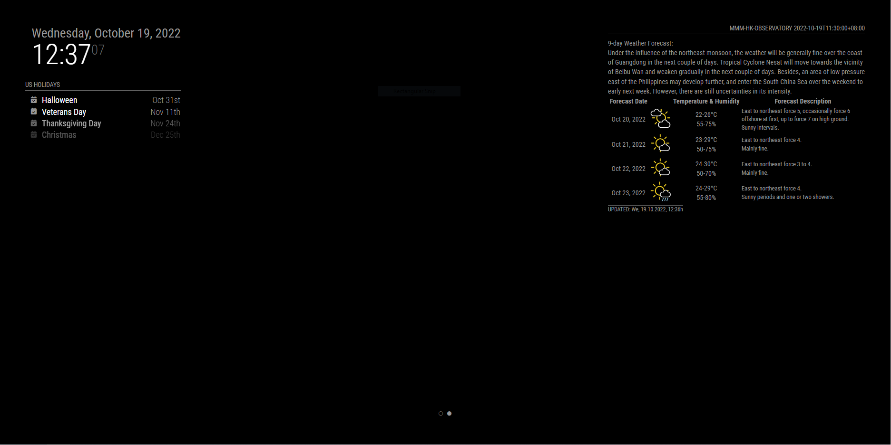

# MMM-HK-Observatory-LMC

<p style="text-align: center">
    <a href="https://choosealicense.com/licenses/apache-2.0/"></a>
</p>

A module for [MagicMirror](https://github.com/MichMich/MagicMirror) displaying Hong Kong 9-day Weather Forecast.

Based on [Hong Kong Observatory Open Data API](https://www.hko.gov.hk/en/weatherAPI/doc/files/HKO_Open_Data_API_Documentation.pdf).

Many thanks to [Peter Schmalfeldt](https://github.com/manifestinteractive) who provide the [MMM-Leap-Motion](https://github.com/manifestinteractive/MMM-Leap-Motion) module.

## Screenshots
| |  |
| --- |-------------------------------------------------|
| Default | 9-day Forecast                                  |

## Installation

````javascript
cd modules
git clone https://github.com/MVTHK/MMM-HK-Observatory-LMC.git
cd MMM-HK-Observatory-LMC
npm install
````

## Use this module

Add the code below to the modules array in the `config/config.js` file:

````javascript
    modules: [
        {
            module: "MMM-HK-Observatory-LMC",
            header: "MMM-HK-Observatory-LMC",
            position: "top_right",
            config: {
                animationSpeed: 2000,
                updateInterval: 600000,
                maxForecast: 4,
                showFooter: true,
                record:false,
                watchGestureUp: true,
                watchGestureDown: true,
                watchGestureLeft: true,
                watchGestureRight: true,
                watchGestureForward: true,
                watchGestureBack: true,
                orientation: 'up'
            }
        }
    ]
````


## Configuration options
| Option                                                                                                                                       | Type      | Default  | Description                                                              |
|----------------------------------------------------------------------------------------------------------------------------------------------|-----------|----------|--------------------------------------------------------------------------|
| `animationSpeed`                                                                                                                             | `int`     | `2000`   | Time to display when startup [milliseconds] (2 second )                  |
| `updateInterval`                                                                                                                             | `int`     | `600000` | Frequency to update the forecast [milliseconds] (10 minutes )            |
| `maxForecast`                                                                                                                                | `int`     | `4`      | The maximum number of weather forecast day will be displayed by default  |
| `showFooter`                                                                                                                                 | `boolean` | `true`   | Last update time                                                         |
| `watchGestureUp`<br/>`watchGestureDown`<br/>`watchGestureLeft`<br/>`watchGestureRight`<br/>`watchGestureForward`<br/>`watchGestureBack`<br/> | `boolean` | `true`   | Detect hand up, down, swipe left, swip right, forward or back            |
| `orientation`                                                                                                                                | `string`  | `up`     | Leap Motion Controller orientation. It is allowed to change to `forward` |


## Ways to change page

Add the code to the end of `notificationReceived` function in [MMM-page-indicator](https://github.com/edward-shen/MMM-page-indicator) `MMM-page-indicator.js`

````javascript
} else if (notification === 'LEAP_MOTION_SWIPE_RIGHT') {
    if (this.curPage === this.config.pages){
        return
    }
    this.sendNotification("PAGE_CHANGED", this.curPage + 1);
} else if (notification === 'LEAP_MOTION_SWIPE_LEFT') {
    if (this.curPage === 0){
        return
    }
    this.sendNotification("PAGE_CHANGED", this.curPage - 1);
````

Or any other commands in that module you like.

## Demonstration

View demo on [YouTube](https://youtu.be/fXoWLlfhFok).

## ERR!

````blog
npm ERR! command C:\WINDOWS\system32\cmd.exe /d /s /c prebuild-install --tag-prefix @serialport/bindings@ || node-gyp rebuild
````
You need to install the latest version of Visual Studio including the "Desktop development with C++" workload
## Warning !

Please remember to kill the current terminal and start a new server if you have modified the code, otherwise the function will run double times.

|  |
|----------------------------------|
| Error occurred                   |
